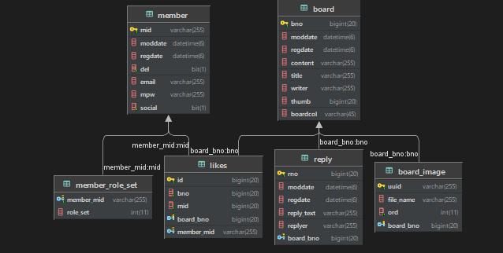

## WorkBook

스프링 부트를 이용한 게시판 

---

## 🖥️ 프로젝트 소개

국내 개발 시장에서 가장 큰 영역을 차지하고 있는 스프링 중 소위 말하는 “게시판”을 어떤 식으로 만들고 개발해야하는지 학습하기 위해 시작한 프로젝트

---

## 📌 주요 기능

- CRUD
- 소셜로그인

---

## ⏲️ 히스토리

---

## 개발환경

- Intellij
- SpringBoot
- MariaDB
- AWS
- Thymeleaf

## 라이브러리

- JPA
- Spring Security
- Swagger-UI

---

ERD

---
